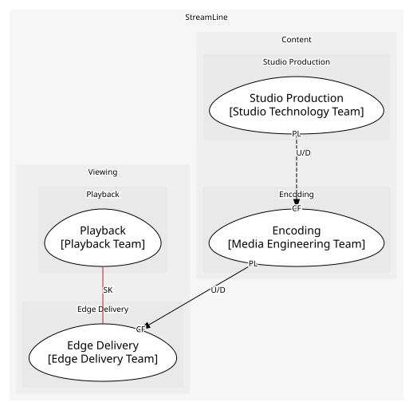
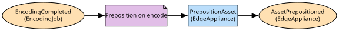

# Edge Delivery
Appliances in ISPs and what they cache

**Owned by:** Edge Delivery Team

## Serves
- [Viewing / Edge Delivery](../../domains/viewing/subdomains/edge_delivery/index.md) (core)

## Glossary
| Term | Definition | Aliases | Embodied by |
| --- | --- | --- | --- |
| **Appliance** | A cache box installed in an ISP's network | Open cache box | EdgeAppliance |
| **Region** | A group of appliances by network geography. Not a licensing territory | - | EdgeAppliance |

## Aggregates

### [EdgeAppliance](aggregates/edge_appliance/index.md)
A cache box in an ISP and what it holds

	
## Services
> No services.

## Schemas
| Name | Description | Attributes | Used by |
| --- | --- | --- | --- |
| ResolveEdge | - | clientIp: `string`, renditionIds: `string[]` | ResolveEdge |

## Policies

| Name | Description | On | Then |
| --- | --- | --- | --- |
| Preposition on encode | New renditions are pushed to appliances by predicted popularity | EncodingCompleted | PrepositionAsset |

## Context Relationships
| Upstream | Relationship | Downstream | Upstream Roles | Downstream Roles |
| --- | --- | --- | --- | --- |
| Encoding | upstream-downstream | Edge Delivery | published-language | conformist |
| Playback | shared-kernel | Edge Delivery | - | - |
| Studio Production | upstream-downstream (implied) | Encoding | published-language | conformist |

## Consumptions
| Consumer | Consumed As | Provider | Consumable | Provided As |
| --- | --- | --- | --- | --- |
| [PlaybackSession](../playback/aggregates/playback_session/index.md) | conformist | EdgeAppliance | ResolveEdge | open-host-service |
| [EdgeAppliance](aggregates/edge_appliance/index.md) | conformist | EncodingJob | EncodingCompleted | published-language |
| [EncodingJob](../encoding/aggregates/encoding_job/index.md) | conformist | Production | MasterDelivered | published-language |

