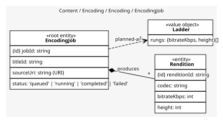
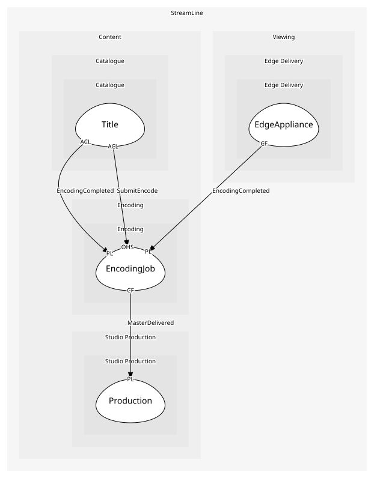

# EncodingJob
One source in, a ladder of renditions out

## Entities and Value Objects
| Type | Name | Description | Attributes |
| --- | --- | --- | --- |
| Entity (Root) | **EncodingJob** | The unit of work for one master | **jobId**: `string`, titleId: `string`, sourceUri: `string (URI)`, status: `'queued' | 'running' | 'completed' | 'failed'` |
| Entity | Rendition | One codec, bitrate and resolution; an entity because each is addressed by the player | **renditionId**: `string`, codec: `string`, bitrateKbps: `int`, height: `int` |
| Value Object | Ladder | The planned rungs: bitrate and resolution pairs chosen for this title's content | rungs: `{bitrateKbps, height}[]` |

## Relationships
| Source | Description | Target | Relation | Cardinality |
| --- | --- | --- | --- | --- |
| [EncodingJob](entities/encoding_job/index.md) | produces | EncodingJob - Rendition | includes | * |
| [EncodingJob](entities/encoding_job/index.md) | planned-as | EncodingJob - Ladder | uses | 1 |

## Invariants
| Name | Description | Constrains |
| --- | --- | --- |
| LadderHasLowestRung | Every ladder has a rung under 300 kbit/s so a stream starts on a bad network | Ladder |
| RenditionsMatchLadder | A completed job has exactly one rendition per planned rung | Rendition, Ladder |

## Provides
| Name | Type | Internal | Pattern | Description | Schema | Raises |
| --- | --- | --- | --- | --- | --- | --- |
| EncodeQueued | event | yes | - | A job is waiting for a ladder plan | - | - |
| EncodingCompleted | event | no | published-language | All renditions are available | [EncodingCompleted](../../index.md#schemas) | - |
| SubmitEncode | operation | no | open-host-service | Queue a master for encoding | [SubmitEncode](../../index.md#schemas) | EncodeQueued |
| CompleteJob | operation | yes | - | Record the finished renditions | - | EncodingCompleted |

## Consumes

### MasterDelivered [conformist]
A finished master is in the delivery bucket
- **Provider**: [Production](../../../studio_production/aggregates/production/index.md)

	
