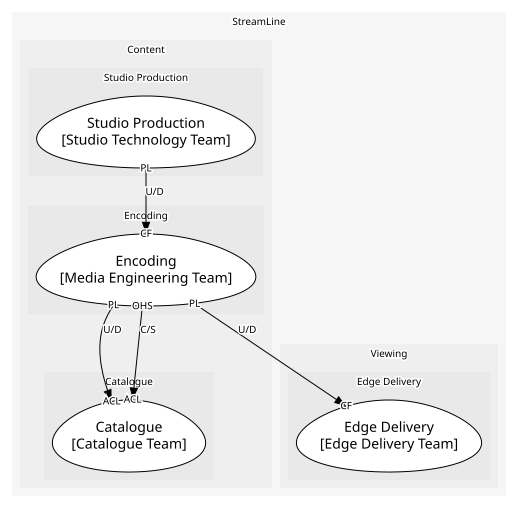
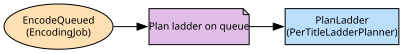

# Encoding
Jobs that turn a master into a ladder of renditions

**Owned by:** Media Engineering Team

## Serves
- [Content / Encoding](../../domains/content/subdomains/encoding/index.md) (core)

## Glossary
| Term | Definition | Aliases | Embodied by |
| --- | --- | --- | --- |
| **Ladder** | The set of bitrate and resolution rungs a title is encoded at | - | Ladder |
| **Rendition** | One encoded version of a title. Older documents say profile, which collides with member profiles | Profile | Rendition |

## Aggregates

### [EncodingJob](aggregates/encoding_job/index.md)
One source in, a ladder of renditions out

	
## Services

### [PerTitleLadderPlanner](services/per_title_ladder_planner/index.md)
Analyses the source and chooses rungs; a domain service because it compares against every previous title

## Schemas
| Name | Description | Attributes | Used by |
| --- | --- | --- | --- |
| SubmitEncode | - | titleId: `string`, sourceUri: `string (URI)` | SubmitEncode |
| EncodingCompleted | The rendition list the catalogue and the edge react to | **jobId**: `string`, titleId: `string`, renditionIds: `string[]` | EncodingCompleted |

## Policies

| Name | Description | On | Then |
| --- | --- | --- | --- |
| Plan ladder on queue | Every queued job gets a per-title ladder before it runs | EncodeQueued | PlanLadder |

## Context Relationships
| Upstream | Relationship | Downstream | Upstream Roles | Downstream Roles |
| --- | --- | --- | --- | --- |
| Studio Production | upstream-downstream | Encoding | published-language | conformist |
| Encoding | customer-supplier | Catalogue | open-host-service, published-language | anti-corruption-layer |
| Encoding | upstream-downstream | Edge Delivery | published-language | conformist |

## Consumptions
| Consumer | Consumed As | Provider | Consumable | Provided As |
| --- | --- | --- | --- | --- |
| [Title](../catalogue/aggregates/title/index.md) | anti-corruption-layer | EncodingJob | EncodingCompleted | published-language |
| [EdgeAppliance](../edge_delivery/aggregates/edge_appliance/index.md) | conformist | EncodingJob | EncodingCompleted | published-language |
| [Title](../catalogue/aggregates/title/index.md) | anti-corruption-layer | EncodingJob | SubmitEncode | open-host-service |
| [EncodingJob](aggregates/encoding_job/index.md) | conformist | Production | MasterDelivered | published-language |

