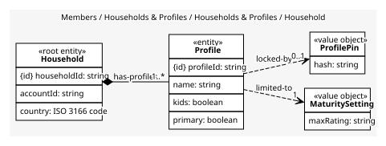
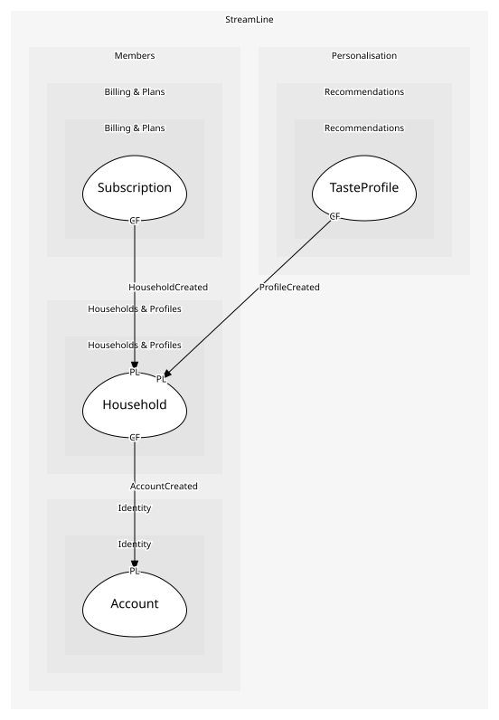

# Household
The paying unit and the people in it; profile rules are checked across the household

## Entities and Value Objects
| Type | Name | Description | Attributes |
| --- | --- | --- | --- |
| Entity (Root) | **Household** | One paying unit | **householdId**: `string`, accountId: `string`, country: `ISO 3166 code` |
| Entity | Profile | One person's viewing identity | **profileId**: `string`, name: `string`, kids: `boolean`, primary: `boolean` |
| Value Object | MaturitySetting | The highest rating a profile may play | maxRating: `string` |
| Value Object | ProfilePin | Four digits that unlock a profile or raise a maturity cap | hash: `string` |

## Relationships
| Source | Description | Target | Relation | Cardinality |
| --- | --- | --- | --- | --- |
| [Household](entities/household/index.md) | has-profiles | Household - Profile | includes | 1..* |
| [Profile](entities/profile/index.md) | limited-to | Household - MaturitySetting | uses | 1 |
| [Profile](entities/profile/index.md) | locked-by | Household - ProfilePin | uses | 0..1 |

## Invariants
| Name | Description | Constrains |
| --- | --- | --- |
| MaxFiveProfiles | A household has at most five profiles | Household |
| OnePrimaryProfile | Exactly one profile is primary | Profile |
| KidsProfileMaturityCapped | A kids profile's maturity cap cannot be raised without the PIN | MaturitySetting, ProfilePin |

## Provides
| Name | Type | Internal | Pattern | Description | Schema | Raises |
| --- | --- | --- | --- | --- | --- | --- |
| HouseholdCreated | event | no | published-language | A new paying unit exists, without a plan yet | [HouseholdCreated](../../index.md#schemas) | - |
| ProfileCreated | event | no | published-language | A profile exists; personalisation starts a taste profile | [ProfileCreated](../../index.md#schemas) | - |
| CreateHousehold | operation | yes | - | Create the household and its primary profile for a new account | - | HouseholdCreated, ProfileCreated |
| CreateProfile | operation | no | open-host-service | Add a profile, within the limit | [ProfileCreated](../../index.md#schemas) | ProfileCreated |

## Consumes

### AccountCreated [conformist]
Someone signed up
- **Provider**: [Account](../../../identity/aggregates/account/index.md)

	
