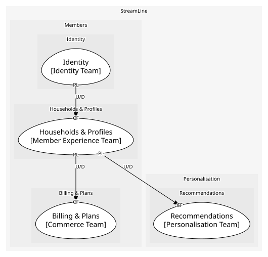
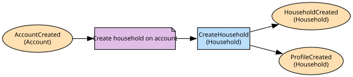

# Households & Profiles
The paying unit and up to five profiles

**Owned by:** Member Experience Team

## Serves
- [Members / Households & Profiles](../../domains/members/subdomains/households_&_profiles/index.md) (supporting)

## Glossary
| Term | Definition | Aliases | Embodied by |
| --- | --- | --- | --- |
| **Household** | The paying unit and its profiles. Identity's account is the login, not this | Account | Household |
| **Profile** | One person's viewing identity within a household | - | Profile |

## Aggregates

### [Household](aggregates/household/index.md)
The paying unit and the people in it; profile rules are checked across the household

	
## Services
> No services.

## Schemas
| Name | Description | Attributes | Used by |
| --- | --- | --- | --- |
| HouseholdCreated | - | **householdId**: `string`, accountId: `string`, country: `ISO 3166 code` | HouseholdCreated |
| ProfileCreated | - | **profileId**: `string`, householdId: `string`, kids: `boolean` | ProfileCreated, CreateProfile |

## Policies

| Name | Description | On | Then |
| --- | --- | --- | --- |
| Create household on account | Every new account gets a household and a primary profile | AccountCreated | CreateHousehold |

## Context Relationships
| Upstream | Relationship | Downstream | Upstream Roles | Downstream Roles |
| --- | --- | --- | --- | --- |
| Households & Profiles | upstream-downstream | Recommendations | published-language | conformist |
| Identity | upstream-downstream | Households & Profiles | published-language | conformist |
| Households & Profiles | upstream-downstream | Billing & Plans | published-language | conformist |

## Consumptions
| Consumer | Consumed As | Provider | Consumable | Provided As |
| --- | --- | --- | --- | --- |
| [Subscription](../billing_&_plans/aggregates/subscription/index.md) | conformist | Household | HouseholdCreated | published-language |
| [TasteProfile](../recommendations/aggregates/taste_profile/index.md) | conformist | Household | ProfileCreated | published-language |
| [Household](aggregates/household/index.md) | conformist | Account | AccountCreated | published-language |

