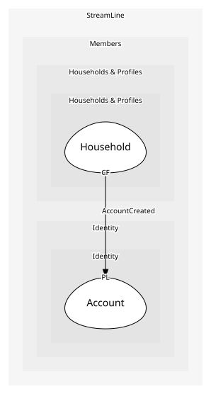

# Account
A login

## Entities and Value Objects
| Type | Name | Description | Attributes |
| --- | --- | --- | --- |
| Entity (Root) | **Account** | Email and credentials | **accountId**: `string`, email: `string` |

## Relationships

## Invariants
> No invariants.

## Provides
| Name | Type | Internal | Pattern | Description | Schema | Raises |
| --- | --- | --- | --- | --- | --- | --- |
| AccountCreated | event | no | published-language | Someone signed up | [AccountCreated](../../index.md#schemas) | - |

## Consumes
> No consumptions.
	
