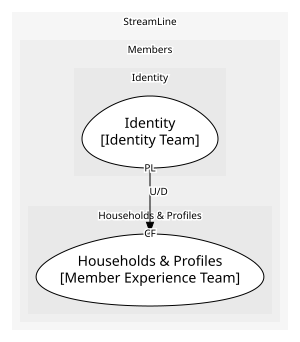

# Identity
Accounts and sign-in

**Owned by:** Identity Team

## Serves
- [Members / Identity](../../domains/members/subdomains/identity/index.md) (generic)

## Glossary
| Term | Definition | Aliases | Embodied by |
| --- | --- | --- | --- |
| **Account** | The login: an email and credentials. Members say account for the household; that is Households' Household | - | Account |

## Aggregates

### [Account](aggregates/account/index.md)
A login

	
## Services

### [IdentityAPI](services/identity_api/index.md)
Sign-up and sign-in

## Schemas
| Name | Description | Attributes | Used by |
| --- | --- | --- | --- |
| AccountCreated | - | **accountId**: `string`, country: `ISO 3166 code` | AccountCreated |

## Policies
> No policies.

## Context Relationships
| Upstream | Relationship | Downstream | Upstream Roles | Downstream Roles |
| --- | --- | --- | --- | --- |
| Identity | upstream-downstream | Households & Profiles | published-language | conformist |

## Consumptions
| Consumer | Consumed As | Provider | Consumable | Provided As |
| --- | --- | --- | --- | --- |
| [Household](../households_&_profiles/aggregates/household/index.md) | conformist | Account | AccountCreated | published-language |

