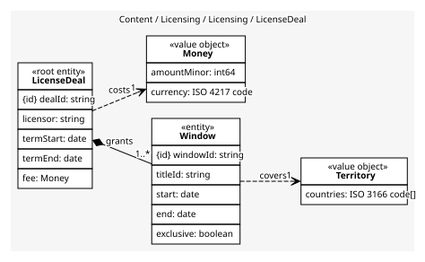
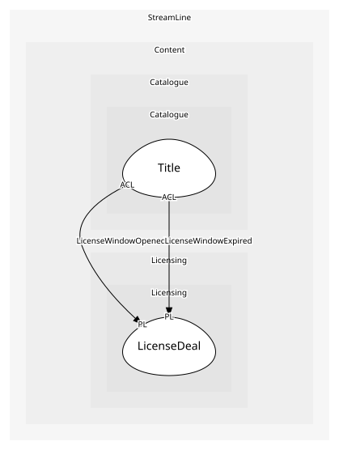

# LicenseDeal
A deal with a licensor and the windows inside it; windows are checked against each other, so they live together

## Entities and Value Objects
| Type | Name | Description | Attributes |
| --- | --- | --- | --- |
| Entity (Root) | **LicenseDeal** | One contract with one licensor for a term | **dealId**: `string`, licensor: `string`, termStart: `date`, termEnd: `date`, fee: `Money` |
| Entity | Window | A territory, a start, an end and whether StreamLine is exclusive | **windowId**: `string`, titleId: `string`, start: `date`, end: `date`, exclusive: `boolean` |
| Value Object | Territory | A set of countries a window covers. Not a cache region | countries: `ISO 3166 code[]` |
| Value Object | Money | An amount in a currency: minor units and an ISO 4217 code | amountMinor: `int64`, currency: `ISO 4217 code` |

## Relationships
| Source | Description | Target | Relation | Cardinality |
| --- | --- | --- | --- | --- |
| [LicenseDeal](entities/license_deal/index.md) | grants | LicenseDeal - Window | includes | 1..* |
| [Window](entities/window/index.md) | covers | LicenseDeal - Territory | uses | 1 |
| [LicenseDeal](entities/license_deal/index.md) | costs | LicenseDeal - Money | uses | 1 |

## Invariants
| Name | Description | Constrains |
| --- | --- | --- |
| WindowWithinTerm | A window never extends past the deal term | Window |
| NoOverlappingWindowsPerTerritory | Two windows for the same title and territory never overlap | Window, Territory |

## Provides
| Name | Type | Internal | Pattern | Description | Schema | Raises |
| --- | --- | --- | --- | --- | --- | --- |
| LicenseWindowOpened | event | no | published-language | A title may be shown in these countries from today | [LicenseWindow](../../index.md#schemas) | - |
| LicenseWindowExpired | event | no | published-language | The title must come down in these countries today | [LicenseWindow](../../index.md#schemas) | - |
| OpenWindow | operation | yes | - | Start a window on its start date | - | LicenseWindowOpened |
| ExpireWindow | operation | yes | - | End a window on its end date | - | LicenseWindowExpired |

## Consumes
> No consumptions.
	
