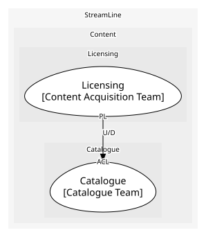

# Licensing
Deals with licensors and the windows inside them

**Owned by:** Content Acquisition Team

## Serves
- [Content / Licensing](../../domains/content/subdomains/licensing/index.md) (core)

## Glossary
| Term | Definition | Aliases | Embodied by |
| --- | --- | --- | --- |
| **Window** | The period and territory in which a licensed title may be shown | - | Window |
| **Territory** | The countries a window covers. Edge Delivery's 'region' is something else | - | Territory |

## Aggregates

### [LicenseDeal](aggregates/license_deal/index.md)
A deal with a licensor and the windows inside it; windows are checked against each other, so they live together

	
## Services
> No services.

## Schemas
| Name | Description | Attributes | Used by |
| --- | --- | --- | --- |
| LicenseWindow | Title, territories and dates; used by both window events | **titleId**: `string`, territory: `Territory`, start: `date`, end: `date` | LicenseWindowOpened, LicenseWindowExpired |

## Policies
> No policies.

## Context Relationships
| Upstream | Relationship | Downstream | Upstream Roles | Downstream Roles |
| --- | --- | --- | --- | --- |
| Licensing | upstream-downstream | Catalogue | published-language | anti-corruption-layer |

## Consumptions
| Consumer | Consumed As | Provider | Consumable | Provided As |
| --- | --- | --- | --- | --- |
| [Title](../catalogue/aggregates/title/index.md) | anti-corruption-layer | LicenseDeal | LicenseWindowOpened | published-language |
| [Title](../catalogue/aggregates/title/index.md) | anti-corruption-layer | LicenseDeal | LicenseWindowExpired | published-language |

