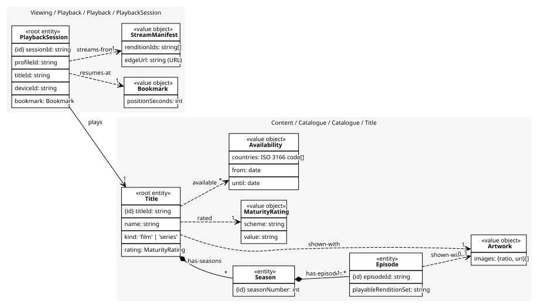
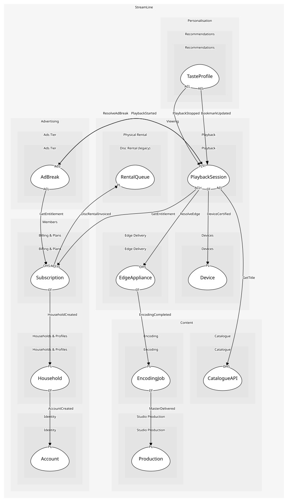

# PlaybackSession
One profile watching one title on one device

## Entities and Value Objects
| Type | Name | Description | Attributes |
| --- | --- | --- | --- |
| Entity (Root) | **PlaybackSession** | The unit playback rules are stated about | **sessionId**: `string`, profileId: `string`, titleId: `string`, deviceId: `string`, bookmark: `Bookmark` |
| Value Object | Bookmark | The resume point; updated every few seconds, kept inside the player | positionSeconds: `int` |
| Value Object | StreamManifest | The renditions and the edge to fetch from, in the format shared with Edge Delivery | renditionIds: `string[]`, edgeUrl: `string (URL)` |

## Relationships
| Source | Description | Target | Relation | Cardinality |
| --- | --- | --- | --- | --- |
| [PlaybackSession](entities/playback_session/index.md) | resumes-at | PlaybackSession - Bookmark | uses | 1 |
| [PlaybackSession](entities/playback_session/index.md) | streams-from | PlaybackSession - StreamManifest | uses | 1 |
| [PlaybackSession](entities/playback_session/index.md) | plays | Title - Title | references | 1 |
| [Title](../../../catalogue/aggregates/title/entities/title/index.md) | has-seasons | Title - Season | includes | * |
| [Season](../../../catalogue/aggregates/title/entities/season/index.md) | has-episodes | Title - Episode | includes | 1..* |
| [Episode](../../../catalogue/aggregates/title/entities/episode/index.md) | shown-with | Title - Artwork | uses | 0..1 |
| [Title](../../../catalogue/aggregates/title/entities/title/index.md) | shown-with | Title - Artwork | uses | 1 |
| [Title](../../../catalogue/aggregates/title/entities/title/index.md) | rated | Title - MaturityRating | uses | 1 |
| [Title](../../../catalogue/aggregates/title/entities/title/index.md) | available | Title - Availability | uses | * |

## Invariants
| Name | Description | Constrains |
| --- | --- | --- |
| SessionNeedsEntitlement | A session starts only with a current entitlement from billing | PlaybackSession |
| WithinStreamLimit | A household never has more concurrent sessions than its plan allows | PlaybackSession |
| BookmarkWithinRuntime | The resume point never exceeds the title's runtime | Bookmark |

## Provides
| Name | Type | Internal | Pattern | Description | Schema | Raises |
| --- | --- | --- | --- | --- | --- | --- |
| PlaybackStarted | event | no | published-language | A session began; the ads tier prepares breaks | [TitleRef](../../../catalogue/index.md#schemas) | - |
| PlaybackStopped | event | no | published-language | A session ended, with how much was watched | [PlaybackStopped](../../index.md#schemas) | - |
| BookmarkUpdated | event | yes | - | The resume point moved; a player detail, not a business fact | - | - |
| StartPlayback | operation | no | open-host-service | Check entitlement and device, build the manifest, start | [StartPlayback](../../index.md#schemas) | PlaybackStarted |
| StopPlayback | operation | no | open-host-service | End the session and report what was watched | - | PlaybackStopped |
| RecordHeartbeat | operation | yes | - | The player reports position every few seconds | - | BookmarkUpdated |

## Consumes

### GetTitle [anti-corruption-layer]
Read a title with seasons, episodes and availability
- **Provider**: [CatalogueAPI](../../../catalogue/services/catalogue_api/index.md)

### ResolveEdge [conformist]
Which appliance a client should fetch from
- **Provider**: [EdgeAppliance](../../../edge_delivery/aggregates/edge_appliance/index.md)

### DeviceCertified [conformist]
A model passed against an SDK version; Playback may use it
- **Provider**: [Device](../../../devices/aggregates/device/index.md)

### GetEntitlement [anti-corruption-layer]
Whether a household may stream, and how many at once
- **Provider**: [Subscription](../../../billing_&_plans/aggregates/subscription/index.md)

### ResolveAdBreak [anti-corruption-layer]
The slots for a break the player has reached
- **Provider**: [AdBreak](../../../ads_tier/aggregates/ad_break/index.md)

	
