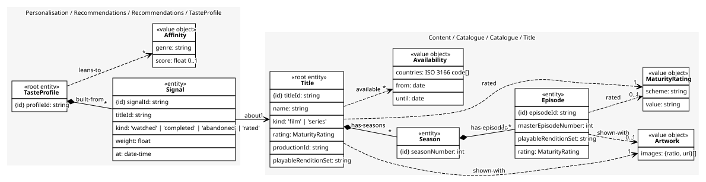
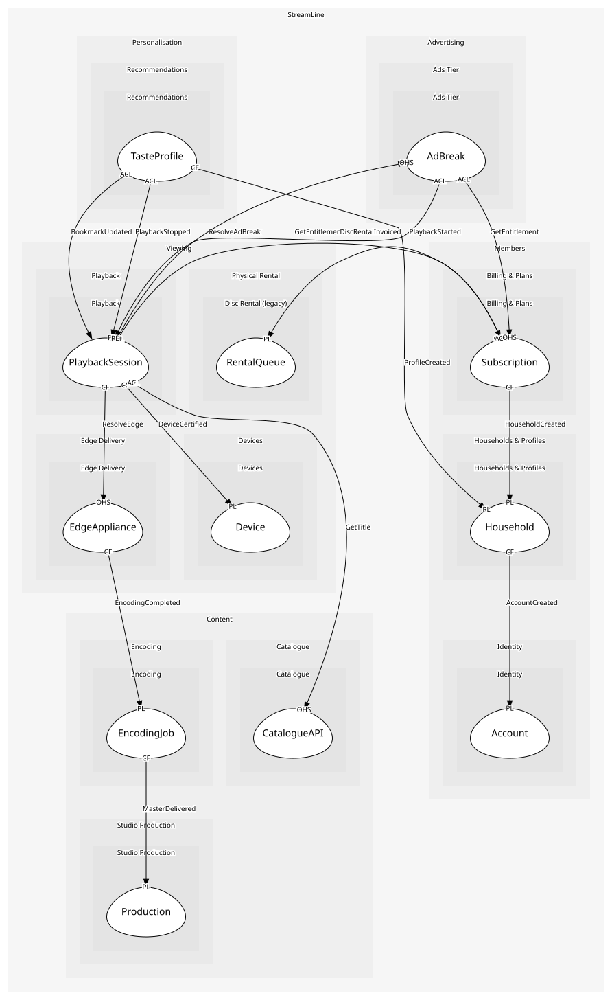

# TasteProfile
What one profile has watched and what it is inferred to like

## Entities and Value Objects
| Type | Name | Description | Attributes |
| --- | --- | --- | --- |
| Entity (Root) | **TasteProfile** | One per member profile | **profileId**: `string` |
| Entity | Signal | One viewing fact with a weight and a time; an entity because signals decay and are audited | **signalId**: `string`, titleId: `string`, kind: `'watched' | 'completed' | 'abandoned' | 'rated'`, weight: `float`, at: `date-time` |
| Value Object | Affinity | A genre or theme and how strongly the profile leans to it | genre: `string`, score: `float 0..1` |

## Relationships
| Source | Description | Target | Relation | Cardinality |
| --- | --- | --- | --- | --- |
| [TasteProfile](entities/taste_profile/index.md) | built-from | TasteProfile - Signal | includes | * |
| [Signal](entities/signal/index.md) | about | Title - Title | references | 1 |
| [Title](../../../catalogue/aggregates/title/entities/title/index.md) | has-seasons | Title - Season | includes | * |
| [Season](../../../catalogue/aggregates/title/entities/season/index.md) | has-episodes | Title - Episode | includes | 1..* |
| [Episode](../../../catalogue/aggregates/title/entities/episode/index.md) | shown-with | Title - Artwork | uses | 0..1 |
| [Episode](../../../catalogue/aggregates/title/entities/episode/index.md) | rated | Title - MaturityRating | uses | 0..1 |
| [Title](../../../catalogue/aggregates/title/entities/title/index.md) | shown-with | Title - Artwork | uses | 1 |
| [Title](../../../catalogue/aggregates/title/entities/title/index.md) | rated | Title - MaturityRating | uses | 1 |
| [Title](../../../catalogue/aggregates/title/entities/title/index.md) | available | Title - Availability | uses | * |
| [TasteProfile](entities/taste_profile/index.md) | leans-to | TasteProfile - Affinity | uses | * |

## Invariants
| Name | Description | Constrains |
| --- | --- | --- |
| SignalsFromOwnProfileOnly | A taste profile holds signals from its own profile, never another in the household | Signal |
| NoAdvertisingSignals | No signal originates from the ads tier; a public commitment | Signal |

## Provides
| Name | Type | Internal | Pattern | Description | Schema | Raises |
| --- | --- | --- | --- | --- | --- | --- |
| RecordSignal | operation | yes | - | Add a viewing signal from a stopped session | - | - |

## Consumes

### PlaybackStopped [anti-corruption-layer]
A session ended, with how much was watched
- **Provider**: [PlaybackSession](../../../playback/aggregates/playback_session/index.md)

### BookmarkUpdated [anti-corruption-layer]
The resume point moved; a player detail, not a business fact
- **Provider**: [PlaybackSession](../../../playback/aggregates/playback_session/index.md)

### ProfileCreated [conformist]
A profile exists; personalisation starts a taste profile
- **Provider**: [Household](../../../households_&_profiles/aggregates/household/index.md)

	
