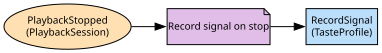

# Recommendations
Taste profiles and the ranker behind the home screen

**Owned by:** Personalisation Team

## Serves
- [Personalisation / Recommendations](../../domains/personalisation/subdomains/recommendations/index.md) (core)

## Glossary
| Term | Definition | Aliases | Embodied by |
| --- | --- | --- | --- |
| **Row** | A horizontal list on the home screen, ranked for one profile | - | Ranker |
| **Signal** | One viewing fact that shapes a taste profile | - | Signal |

## Aggregates

### [TasteProfile](aggregates/taste_profile/index.md)
What one profile has watched and what it is inferred to like

	
## Services

### [Ranker](services/ranker/index.md)
Orders candidate titles into rows for a profile; a domain service because it reads across every taste profile's affinities

### [RecommendationsAPI](services/recommendations_api/index.md)
What the apps call for the home screen

## Schemas
> No schemas.

## Policies

| Name | Description | On | Then |
| --- | --- | --- | --- |
| Add candidate on publish | A published title joins the candidate pool; an availability change updates where it may be recommended | TitlePublished, TitleAvailabilityChanged | AddCandidate |
| Record signal on stop | Every stopped session becomes a signal on the profile's taste | PlaybackStopped | RecordSignal |

## Context Relationships
| Upstream | Relationship | Downstream | Upstream Roles | Downstream Roles |
| --- | --- | --- | --- | --- |
| Catalogue | upstream-downstream | Recommendations | published-language | conformist |
| Playback | upstream-downstream | Recommendations | published-language | anti-corruption-layer |
| Households & Profiles | upstream-downstream | Recommendations | published-language | conformist |
| Ads Tier | separate-ways | Recommendations | - | - |
| Studio Production | upstream-downstream (implied) | Catalogue | published-language | anti-corruption-layer |
| Encoding | upstream-downstream (implied) | Catalogue | published-language, open-host-service | anti-corruption-layer |
| Studio Production | upstream-downstream (implied) | Encoding | published-language | conformist |
| Licensing | upstream-downstream (implied) | Catalogue | published-language | anti-corruption-layer |
| Catalogue | upstream-downstream (implied) | Playback | open-host-service | anti-corruption-layer |
| Edge Delivery | upstream-downstream (implied) | Playback | open-host-service | conformist |
| Encoding | upstream-downstream (implied) | Edge Delivery | published-language | conformist |
| Devices | upstream-downstream (implied) | Playback | published-language | conformist |
| Billing & Plans | upstream-downstream (implied) | Playback | open-host-service | anti-corruption-layer |
| Households & Profiles | upstream-downstream (implied) | Billing & Plans | published-language | conformist |
| Identity | upstream-downstream (implied) | Households & Profiles | published-language | conformist |
| Disc Rental (legacy) | upstream-downstream (implied) | Billing & Plans | published-language | anti-corruption-layer |
| Ads Tier | upstream-downstream (implied) | Playback | open-host-service | anti-corruption-layer |
| Playback | upstream-downstream (implied) | Ads Tier | published-language | anti-corruption-layer |
| Billing & Plans | upstream-downstream (implied) | Ads Tier | open-host-service | anti-corruption-layer |

## Consumptions
| Consumer | Consumed As | Provider | Consumable | Provided As |
| --- | --- | --- | --- | --- |
| [Ranker](services/ranker/index.md) | conformist | Title | TitlePublished | published-language |
| [Title](../catalogue/aggregates/title/index.md) | anti-corruption-layer | Production | MasterDelivered | published-language |
| [Title](../catalogue/aggregates/title/index.md) | anti-corruption-layer | EncodingJob | EncodingCompleted | published-language |
| [EncodingJob](../encoding/aggregates/encoding_job/index.md) | conformist | Production | MasterDelivered | published-language |
| [Title](../catalogue/aggregates/title/index.md) | anti-corruption-layer | LicenseDeal | LicenseWindowOpened | published-language |
| [Title](../catalogue/aggregates/title/index.md) | anti-corruption-layer | LicenseDeal | LicenseWindowExpired | published-language |
| [Title](../catalogue/aggregates/title/index.md) | anti-corruption-layer | EncodingJob | SubmitEncode | open-host-service |
| [Ranker](services/ranker/index.md) | conformist | Title | TitleAvailabilityChanged | published-language |
| [TasteProfile](aggregates/taste_profile/index.md) | anti-corruption-layer | PlaybackSession | PlaybackStopped | published-language |
| [PlaybackSession](../playback/aggregates/playback_session/index.md) | anti-corruption-layer | CatalogueAPI | GetTitle | open-host-service |
| [PlaybackSession](../playback/aggregates/playback_session/index.md) | conformist | EdgeAppliance | ResolveEdge | open-host-service |
| [EdgeAppliance](../edge_delivery/aggregates/edge_appliance/index.md) | conformist | EncodingJob | EncodingCompleted | published-language |
| [PlaybackSession](../playback/aggregates/playback_session/index.md) | conformist | Device | DeviceCertified | published-language |
| [PlaybackSession](../playback/aggregates/playback_session/index.md) | anti-corruption-layer | Subscription | GetEntitlement | open-host-service |
| [Subscription](../billing_&_plans/aggregates/subscription/index.md) | conformist | Household | HouseholdCreated | published-language |
| [Household](../households_&_profiles/aggregates/household/index.md) | conformist | Account | AccountCreated | published-language |
| [Subscription](../billing_&_plans/aggregates/subscription/index.md) | anti-corruption-layer | RentalQueue | DiscRentalInvoiced | published-language |
| [PlaybackSession](../playback/aggregates/playback_session/index.md) | anti-corruption-layer | AdBreak | ResolveAdBreak | open-host-service |
| [AdBreak](../ads_tier/aggregates/ad_break/index.md) | anti-corruption-layer | PlaybackSession | PlaybackStarted | published-language |
| [AdBreak](../ads_tier/aggregates/ad_break/index.md) | anti-corruption-layer | Subscription | GetEntitlement | open-host-service |
| [TasteProfile](aggregates/taste_profile/index.md) | anti-corruption-layer | PlaybackSession | BookmarkUpdated | - |
| [TasteProfile](aggregates/taste_profile/index.md) | conformist | Household | ProfileCreated | published-language |

