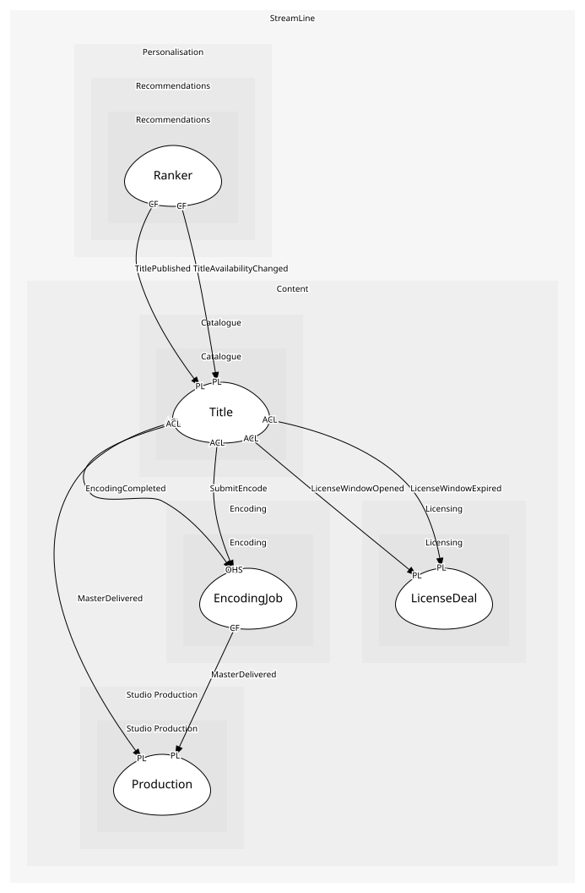

# Ranker
Orders candidate titles into rows for a profile; a domain service because it reads across every taste profile's affinities

## Provides
| Name | Type | Internal | Pattern | Description | Schema | Raises |
| --- | --- | --- | --- | --- | --- | --- |
| RankRows | operation | yes | - | Build the home screen rows for a profile | - | - |
| AddCandidate | operation | yes | - | Add or refresh a title in the candidate pool with the countries it is live in | - | - |

## Consumes

### TitlePublished [conformist]
Members can now see the title somewhere
- **Provider**: [Title](../../../catalogue/aggregates/title/index.md)

### TitleAvailabilityChanged [conformist]
Where and when a title is live changed
- **Provider**: [Title](../../../catalogue/aggregates/title/index.md)

	
