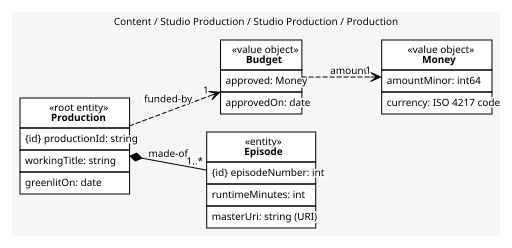
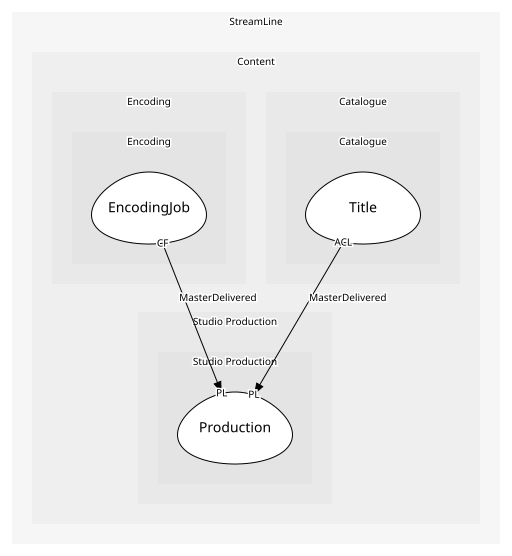

# Production
One original from greenlight to delivered masters

## Entities and Value Objects
| Type | Name | Description | Attributes |
| --- | --- | --- | --- |
| Entity (Root) | **Production** | A commissioned film or series | **productionId**: `string`, workingTitle: `string`, greenlitOn: `date`, phase: `'development' | 'shooting' | 'post' | 'delivered'` |
| Entity | Episode | A production artefact: a number, a runtime and eventually a master. Not the catalogue's episode | **episodeNumber**: `int`, runtimeMinutes: `int`, masterUri: `string (URI)` |
| Value Object | Budget | Approved spend; a value because two productions with the same figures have the same budget | approved: `Money`, approvedOn: `date` |
| Value Object | Money | An amount in a currency: minor units and an ISO 4217 code | amountMinor: `int64`, currency: `ISO 4217 code` |

## Relationships
| Source | Description | Target | Relation | Cardinality |
| --- | --- | --- | --- | --- |
| [Production](entities/production/index.md) | made-of | Production - Episode | includes | 1..* |
| [Production](entities/production/index.md) | funded-by | Production - Budget | uses | 1 |
| [Budget](valueobjects/budget/index.md) | amount | Production - Money | uses | 1 |

## Invariants
| Name | Description | Constrains |
| --- | --- | --- |
| BudgetApprovedBeforeShoot | The phase cannot move to shooting until the budget carries an approval date | Budget, Production.phase |
| EpisodeNumbersUnique | Episode numbers within a production are unique; the delivery spec keys on them | Episode.episodeNumber |

## Provides
| Name | Type | Internal | Pattern | Description | Schema | Raises |
| --- | --- | --- | --- | --- | --- | --- |
| ProductionGreenlit | event | yes | - | The slate gained a title; scheduling is out of scope here | - | - |
| MasterDelivered | event | no | published-language | A finished master is in the delivery bucket | [MasterDelivered](../../index.md#schemas) | - |
| Greenlight | operation | yes | - | Commission the production | - | ProductionGreenlit |

## Consumes
> No consumptions.
	
