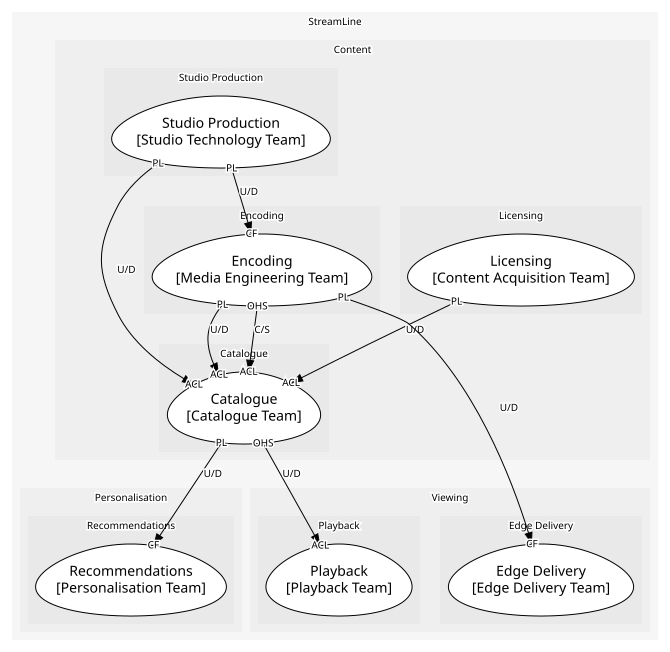

# Content
Making, licensing and preparing the slate

## Subdomains

### [Studio Production](subdomains/studio_production/index.md) (core)
Originals from greenlight to delivered master. Core: the exclusive part of the slate

### [Licensing](subdomains/licensing/index.md) (core)
Third-party titles by territory and window. Core: exclusive windows are fought over

### [Catalogue](subdomains/catalogue/index.md) (supporting)
Titles, seasons, episodes, availability. Supporting: must be excellent and boring

### [Encoding](subdomains/encoding/index.md) (core)
Per-title ladders and renditions. Core: a real quality and cost advantage

## Context Relationships
| Upstream | Relationship | Downstream | Upstream Roles | Downstream Roles |
| --- | --- | --- | --- | --- |
| Studio Production | upstream-downstream | Catalogue | published-language | anti-corruption-layer |
| Studio Production | upstream-downstream | Encoding | published-language | conformist |
| Licensing | upstream-downstream | Catalogue | published-language | anti-corruption-layer |
| Encoding | upstream-downstream | Catalogue | published-language | anti-corruption-layer |
| Encoding | customer-supplier | Catalogue | open-host-service | anti-corruption-layer |
| Encoding | upstream-downstream | Edge Delivery | published-language | conformist |
| Catalogue | upstream-downstream | Playback | open-host-service | anti-corruption-layer |
| Catalogue | upstream-downstream | Recommendations | published-language | conformist |

## Consumptions
| Consumer | Consumed As | Provider | Consumable | Provided As |
| --- | --- | --- | --- | --- |
| [EncodingJob](../../boundedcontexts/encoding/aggregates/encoding_job/index.md) | conformist | Production | MasterDelivered | published-language |
| [Title](../../boundedcontexts/catalogue/aggregates/title/index.md) | anti-corruption-layer | Production | MasterDelivered | published-language |
| [Title](../../boundedcontexts/catalogue/aggregates/title/index.md) | anti-corruption-layer | LicenseDeal | LicenseWindowOpened | published-language |
| [Title](../../boundedcontexts/catalogue/aggregates/title/index.md) | anti-corruption-layer | LicenseDeal | LicenseWindowExpired | published-language |
| [PlaybackSession](../../boundedcontexts/playback/aggregates/playback_session/index.md) | anti-corruption-layer | CatalogueAPI | GetTitle | open-host-service |
| [TasteProfile](../../boundedcontexts/recommendations/aggregates/taste_profile/index.md) | conformist | Title | TitlePublished | published-language |
| [Title](../../boundedcontexts/catalogue/aggregates/title/index.md) | anti-corruption-layer | EncodingJob | EncodingCompleted | published-language |
| [EdgeAppliance](../../boundedcontexts/edge_delivery/aggregates/edge_appliance/index.md) | conformist | EncodingJob | EncodingCompleted | published-language |
| [Title](../../boundedcontexts/catalogue/aggregates/title/index.md) | anti-corruption-layer | EncodingJob | SubmitEncode | open-host-service |

	
