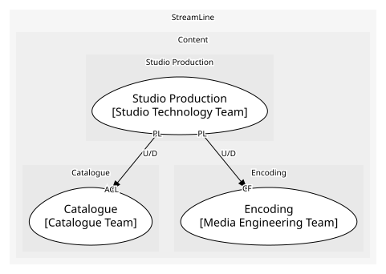

# Studio Production (core)
Originals from greenlight to delivered master. Core: the exclusive part of the slate

## Bounded Contexts

### [Studio Production](../../../../boundedcontexts/studio_production/index.md)
Productions, episodes and delivered masters

## Context Relationships
| Upstream | Relationship | Downstream | Upstream Roles | Downstream Roles |
| --- | --- | --- | --- | --- |
| Studio Production | upstream-downstream | Catalogue | published-language | anti-corruption-layer |
| Studio Production | upstream-downstream | Encoding | published-language | conformist |

## Consumptions
| Consumer | Consumed As | Provider | Consumable | Provided As |
| --- | --- | --- | --- | --- |
| [EncodingJob](../../../../boundedcontexts/encoding/aggregates/encoding_job/index.md) | conformist | Production | MasterDelivered | published-language |
| [Title](../../../../boundedcontexts/catalogue/aggregates/title/index.md) | anti-corruption-layer | Production | MasterDelivered | published-language |
	
	
