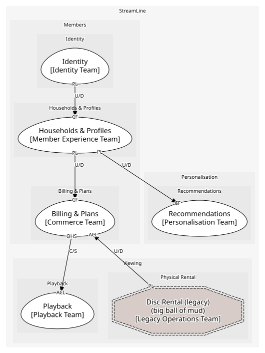

# Members
Households, plans, sign-in

## Subdomains

### [Households & Profiles](subdomains/households_&_profiles/index.md) (supporting)
The paying unit and the people in it

### [Billing & Plans](subdomains/billing_&_plans/index.md) (generic)
Plans, subscriptions, invoices, entitlement. Generic: "we would happily buy all of this"

### [Identity](subdomains/identity/index.md) (generic)
Accounts and sign-in

## Context Relationships
| Upstream | Relationship | Downstream | Upstream Roles | Downstream Roles |
| --- | --- | --- | --- | --- |
| Households & Profiles | upstream-downstream | Recommendations | published-language | conformist |
| Billing & Plans | customer-supplier | Playback | open-host-service | anti-corruption-layer |
| Identity | upstream-downstream | Households & Profiles | published-language | conformist |
| Households & Profiles | upstream-downstream | Billing & Plans | published-language | conformist |
| Disc Rental (legacy) | upstream-downstream | Billing & Plans | published-language | anti-corruption-layer |

## Consumptions
| Consumer | Consumed As | Provider | Consumable | Provided As |
| --- | --- | --- | --- | --- |
| [Subscription](../../boundedcontexts/billing_&_plans/aggregates/subscription/index.md) | conformist | Household | HouseholdCreated | published-language |
| [TasteProfile](../../boundedcontexts/recommendations/aggregates/taste_profile/index.md) | conformist | Household | ProfileCreated | published-language |
| [Household](../../boundedcontexts/households_&_profiles/aggregates/household/index.md) | conformist | Account | AccountCreated | published-language |
| [PlaybackSession](../../boundedcontexts/playback/aggregates/playback_session/index.md) | anti-corruption-layer | Subscription | GetEntitlement | open-host-service |
| [Subscription](../../boundedcontexts/billing_&_plans/aggregates/subscription/index.md) | anti-corruption-layer | RentalQueue | DiscRentalInvoiced | published-language |

	
