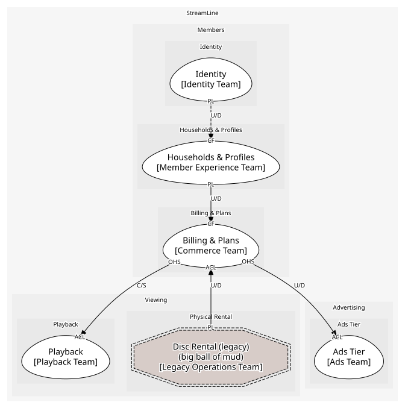

# Billing & Plans (generic)
Plans, subscriptions, invoices, entitlement. Generic: "we would happily buy all of this"

## Bounded Contexts

### [Billing & Plans](../../../../boundedcontexts/billing_&_plans/index.md)
Subscriptions, invoices and entitlement

## Context Relationships
| Upstream | Relationship | Downstream | Upstream Roles | Downstream Roles |
| --- | --- | --- | --- | --- |
| Billing & Plans | customer-supplier | Playback | open-host-service | anti-corruption-layer |
| Billing & Plans | upstream-downstream | Ads Tier | open-host-service | anti-corruption-layer |
| Households & Profiles | upstream-downstream | Billing & Plans | published-language | conformist |
| Disc Rental (legacy) | upstream-downstream | Billing & Plans | published-language | anti-corruption-layer |
| Identity | upstream-downstream (implied) | Households & Profiles | published-language | conformist |

## Consumptions
| Consumer | Consumed As | Provider | Consumable | Provided As |
| --- | --- | --- | --- | --- |
| [PlaybackSession](../../../../boundedcontexts/playback/aggregates/playback_session/index.md) | anti-corruption-layer | Subscription | GetEntitlement | open-host-service |
| [AdBreak](../../../../boundedcontexts/ads_tier/aggregates/ad_break/index.md) | anti-corruption-layer | Subscription | GetEntitlement | open-host-service |
| [Subscription](../../../../boundedcontexts/billing_&_plans/aggregates/subscription/index.md) | conformist | Household | HouseholdCreated | published-language |
| [Household](../../../../boundedcontexts/households_&_profiles/aggregates/household/index.md) | conformist | Account | AccountCreated | published-language |
| [Subscription](../../../../boundedcontexts/billing_&_plans/aggregates/subscription/index.md) | anti-corruption-layer | RentalQueue | DiscRentalInvoiced | published-language |
	
	
