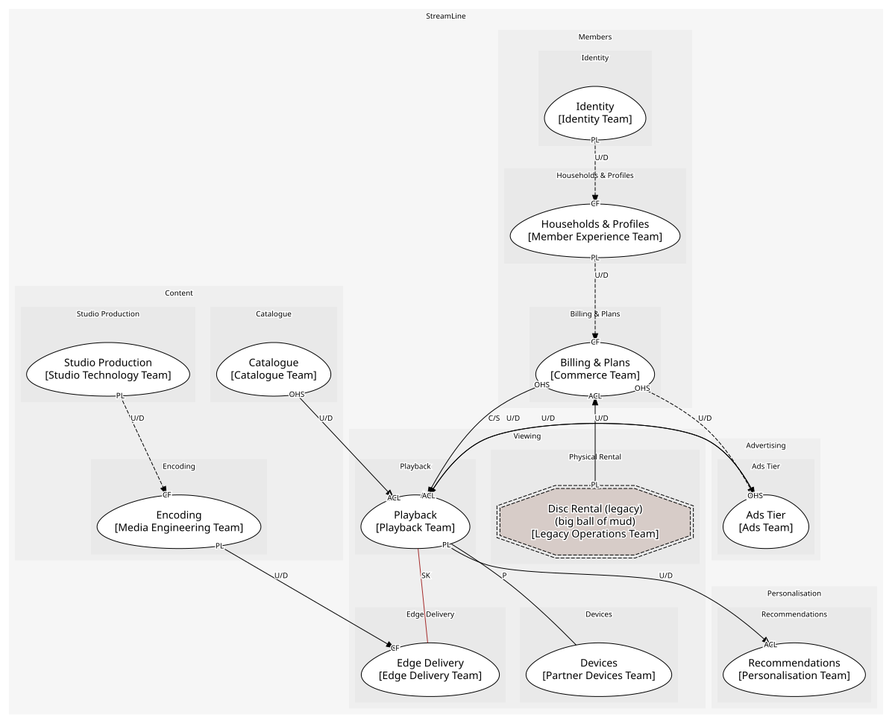

# Viewing
Playing the slate on anything, anywhere

## Subdomains

### [Playback](subdomains/playback/index.md) (core)
Sessions, manifests, bitrate selection. Core: "we play them perfectly"

### [Edge Delivery](subdomains/edge_delivery/index.md) (core)
Caches inside ISPs. Core: why a stream starts in under a second

### [Devices](subdomains/devices/index.md) (supporting)
Partner device registration and certification

### [Physical Rental](subdomains/physical_rental/index.md) (supporting)
The disc-by-post business, kept alive by decision rather than investment

## Context Relationships
| Upstream | Relationship | Downstream | Upstream Roles | Downstream Roles |
| --- | --- | --- | --- | --- |
| Encoding | upstream-downstream | Edge Delivery | published-language | conformist |
| Catalogue | upstream-downstream | Playback | open-host-service | anti-corruption-layer |
| Playback | upstream-downstream | Recommendations | published-language | anti-corruption-layer |
| Billing & Plans | customer-supplier | Playback | open-host-service | anti-corruption-layer |
| Playback | upstream-downstream | Ads Tier | published-language | anti-corruption-layer |
| Ads Tier | upstream-downstream | Playback | open-host-service | anti-corruption-layer |
| Disc Rental (legacy) | upstream-downstream | Billing & Plans | published-language | anti-corruption-layer |
| Playback | shared-kernel | Edge Delivery | - | - |
| Playback | partnership | Devices | - | - |
| Studio Production | upstream-downstream (implied) | Encoding | published-language | conformist |
| Households & Profiles | upstream-downstream (implied) | Billing & Plans | published-language | conformist |
| Identity | upstream-downstream (implied) | Households & Profiles | published-language | conformist |

## Consumptions
| Consumer | Consumed As | Provider | Consumable | Provided As |
| --- | --- | --- | --- | --- |
| [AdBreak](../../boundedcontexts/ads_tier/aggregates/ad_break/index.md) | anti-corruption-layer | PlaybackSession | PlaybackStarted | published-language |
| [TasteProfile](../../boundedcontexts/recommendations/aggregates/taste_profile/index.md) | anti-corruption-layer | PlaybackSession | PlaybackStopped | published-language |
| [TasteProfile](../../boundedcontexts/recommendations/aggregates/taste_profile/index.md) | anti-corruption-layer | PlaybackSession | BookmarkUpdated | - |
| [PlaybackSession](../../boundedcontexts/playback/aggregates/playback_session/index.md) | anti-corruption-layer | CatalogueAPI | GetTitle | open-host-service |
| [PlaybackSession](../../boundedcontexts/playback/aggregates/playback_session/index.md) | conformist | EdgeAppliance | ResolveEdge | open-host-service |
| [EdgeAppliance](../../boundedcontexts/edge_delivery/aggregates/edge_appliance/index.md) | conformist | EncodingJob | EncodingCompleted | published-language |
| [EncodingJob](../../boundedcontexts/encoding/aggregates/encoding_job/index.md) | conformist | Production | MasterDelivered | published-language |
| [PlaybackSession](../../boundedcontexts/playback/aggregates/playback_session/index.md) | conformist | Device | DeviceCertified | published-language |
| [PlaybackSession](../../boundedcontexts/playback/aggregates/playback_session/index.md) | anti-corruption-layer | Subscription | GetEntitlement | open-host-service |
| [Subscription](../../boundedcontexts/billing_&_plans/aggregates/subscription/index.md) | conformist | Household | HouseholdCreated | published-language |
| [Household](../../boundedcontexts/households_&_profiles/aggregates/household/index.md) | conformist | Account | AccountCreated | published-language |
| [Subscription](../../boundedcontexts/billing_&_plans/aggregates/subscription/index.md) | anti-corruption-layer | RentalQueue | DiscRentalInvoiced | published-language |
| [PlaybackSession](../../boundedcontexts/playback/aggregates/playback_session/index.md) | anti-corruption-layer | AdBreak | ResolveAdBreak | open-host-service |

	
