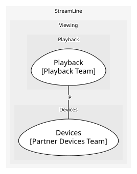

# Devices (supporting)
Partner device registration and certification

## Bounded Contexts

### [Devices](../../../../boundedcontexts/devices/index.md)
Partner device models and their certification

## Context Relationships
| Upstream | Relationship | Downstream | Upstream Roles | Downstream Roles |
| --- | --- | --- | --- | --- |
| Playback | partnership | Devices | - | - |

## Consumptions
| Consumer | Consumed As | Provider | Consumable | Provided As |
| --- | --- | --- | --- | --- |
| [PlaybackSession](../../../../boundedcontexts/playback/aggregates/playback_session/index.md) | conformist | Device | DeviceCertified | published-language |
	
	
