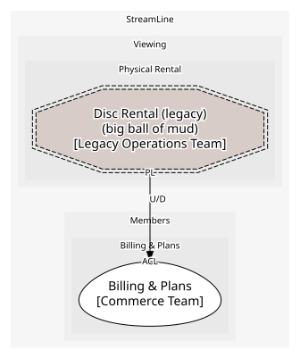

# Physical Rental (supporting)
The disc-by-post business, kept alive by decision rather than investment

## Bounded Contexts

### [Disc Rental (legacy)](../../../../boundedcontexts/disc_rental_(legacy)/index.md)
StreamLine Discs: a 2009 monolith with its own accounts and a monthly charge export. Modelled at its edge only

## Context Relationships
| Upstream | Relationship | Downstream | Upstream Roles | Downstream Roles |
| --- | --- | --- | --- | --- |
| Disc Rental (legacy) | upstream-downstream | Billing & Plans | published-language | anti-corruption-layer |

## Consumptions
| Consumer | Consumed As | Provider | Consumable | Provided As |
| --- | --- | --- | --- | --- |
| [Subscription](../../../../boundedcontexts/billing_&_plans/aggregates/subscription/index.md) | anti-corruption-layer | RentalQueue | DiscRentalInvoiced | published-language |
	
	
