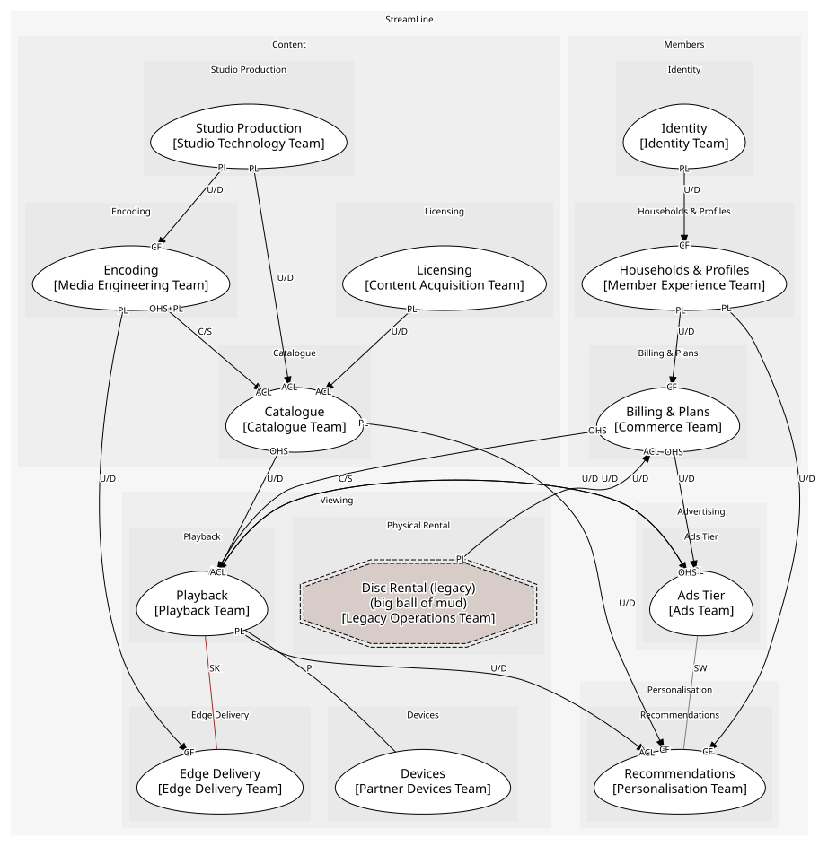

# StreamLine
A fictional streaming service: studio production, licensing, catalogue, encoding, playback and edge delivery, recommendations, households and profiles, billing and plans, devices, an ads tier and a legacy disc business.

[Glossary](./glossary.md)

## Domains

### [Content](../domains/content/index.md)
Making, licensing and preparing the slate

### [Viewing](../domains/viewing/index.md)
Playing the slate on anything, anywhere

### [Personalisation](../domains/personalisation/index.md)
A different home screen for every profile

### [Members](../domains/members/index.md)
Households, plans, sign-in

### [Advertising](../domains/advertising/index.md)
Filling ad breaks on the cheaper plan

## Diagnostics
| Severity | Rule | Message | Element |
| --- | --- | --- | --- |
| error | internal-consumable | "TasteProfile" consumes "BookmarkUpdated" from "Playback", but it is internal to that context | `boundedcontexts/recommendations/aggregates/taste_profile` |
| error | schema-context | "PlaybackStarted" carries schema "TitleRef" from "Catalogue"; a payload belongs to the context that publishes it | `boundedcontexts/playback/aggregates/playback_session/provides/playback_started` |
| warning | policy-complete | Policy "Recertify on SDK release" issues no command | `boundedcontexts/devices/policies/recertify_on_sdk_release` |

## Teams
| Team | Owns |
| --- | --- |
| Studio Technology Team | Studio Production |
| Content Acquisition Team | Licensing |
| Catalogue Team | Catalogue |
| Media Engineering Team | Encoding |
| Playback Team | Playback |
| Edge Delivery Team | Edge Delivery |
| Partner Devices Team | Devices |
| Personalisation Team | Recommendations |
| Member Experience Team | Households & Profiles |
| Commerce Team | Billing & Plans |
| Identity Team | Identity |
| Ads Team | Ads Tier |
| Legacy Operations Team | Disc Rental (legacy) |

## Context Relationships
| Upstream | Relationship | Downstream | Upstream Roles | Downstream Roles |
| --- | --- | --- | --- | --- |
| Studio Production | upstream-downstream | Catalogue | published-language | anti-corruption-layer |
| Studio Production | upstream-downstream | Encoding | published-language | conformist |
| Licensing | upstream-downstream | Catalogue | published-language | anti-corruption-layer |
| Encoding | customer-supplier | Catalogue | open-host-service, published-language | anti-corruption-layer |
| Encoding | upstream-downstream | Edge Delivery | published-language | conformist |
| Catalogue | upstream-downstream | Playback | open-host-service | anti-corruption-layer |
| Catalogue | upstream-downstream | Recommendations | published-language | conformist |
| Playback | upstream-downstream | Recommendations | published-language | anti-corruption-layer |
| Households & Profiles | upstream-downstream | Recommendations | published-language | conformist |
| Billing & Plans | customer-supplier | Playback | open-host-service | anti-corruption-layer |
| Playback | upstream-downstream | Ads Tier | published-language | anti-corruption-layer |
| Ads Tier | upstream-downstream | Playback | open-host-service | anti-corruption-layer |
| Billing & Plans | upstream-downstream | Ads Tier | open-host-service | anti-corruption-layer |
| Identity | upstream-downstream | Households & Profiles | published-language | conformist |
| Households & Profiles | upstream-downstream | Billing & Plans | published-language | conformist |
| Disc Rental (legacy) | upstream-downstream | Billing & Plans | published-language | anti-corruption-layer |
| Playback | shared-kernel | Edge Delivery | - | - |
| Playback | partnership | Devices | - | - |
| Ads Tier | separate-ways | Recommendations | - | - |

## Consumptions
| Consumer | Consumed As | Provider | Consumable | Provided As |
| --- | --- | --- | --- | --- |
| [EncodingJob](../boundedcontexts/encoding/aggregates/encoding_job/index.md) | conformist | Production | MasterDelivered | published-language |
| [Title](../boundedcontexts/catalogue/aggregates/title/index.md) | anti-corruption-layer | Production | MasterDelivered | published-language |
| [Title](../boundedcontexts/catalogue/aggregates/title/index.md) | anti-corruption-layer | LicenseDeal | LicenseWindowOpened | published-language |
| [Title](../boundedcontexts/catalogue/aggregates/title/index.md) | anti-corruption-layer | LicenseDeal | LicenseWindowExpired | published-language |
| [PlaybackSession](../boundedcontexts/playback/aggregates/playback_session/index.md) | anti-corruption-layer | CatalogueAPI | GetTitle | open-host-service |
| [Ranker](../boundedcontexts/recommendations/services/ranker/index.md) | conformist | Title | TitlePublished | published-language |
| [Ranker](../boundedcontexts/recommendations/services/ranker/index.md) | conformist | Title | TitleAvailabilityChanged | published-language |
| [Title](../boundedcontexts/catalogue/aggregates/title/index.md) | anti-corruption-layer | EncodingJob | EncodingCompleted | published-language |
| [EdgeAppliance](../boundedcontexts/edge_delivery/aggregates/edge_appliance/index.md) | conformist | EncodingJob | EncodingCompleted | published-language |
| [Title](../boundedcontexts/catalogue/aggregates/title/index.md) | anti-corruption-layer | EncodingJob | SubmitEncode | open-host-service |
| [AdBreak](../boundedcontexts/ads_tier/aggregates/ad_break/index.md) | anti-corruption-layer | PlaybackSession | PlaybackStarted | published-language |
| [TasteProfile](../boundedcontexts/recommendations/aggregates/taste_profile/index.md) | anti-corruption-layer | PlaybackSession | PlaybackStopped | published-language |
| [TasteProfile](../boundedcontexts/recommendations/aggregates/taste_profile/index.md) | anti-corruption-layer | PlaybackSession | BookmarkUpdated | - |
| [PlaybackSession](../boundedcontexts/playback/aggregates/playback_session/index.md) | conformist | EdgeAppliance | ResolveEdge | open-host-service |
| [PlaybackSession](../boundedcontexts/playback/aggregates/playback_session/index.md) | conformist | Device | DeviceCertified | published-language |
| [PlaybackSession](../boundedcontexts/playback/aggregates/playback_session/index.md) | anti-corruption-layer | Subscription | GetEntitlement | open-host-service |
| [AdBreak](../boundedcontexts/ads_tier/aggregates/ad_break/index.md) | anti-corruption-layer | Subscription | GetEntitlement | open-host-service |
| [Subscription](../boundedcontexts/billing_&_plans/aggregates/subscription/index.md) | conformist | Household | HouseholdCreated | published-language |
| [TasteProfile](../boundedcontexts/recommendations/aggregates/taste_profile/index.md) | conformist | Household | ProfileCreated | published-language |
| [Household](../boundedcontexts/households_&_profiles/aggregates/household/index.md) | conformist | Account | AccountCreated | published-language |
| [Subscription](../boundedcontexts/billing_&_plans/aggregates/subscription/index.md) | anti-corruption-layer | RentalQueue | DiscRentalInvoiced | published-language |
| [PlaybackSession](../boundedcontexts/playback/aggregates/playback_session/index.md) | anti-corruption-layer | AdBreak | ResolveAdBreak | open-host-service |
	

