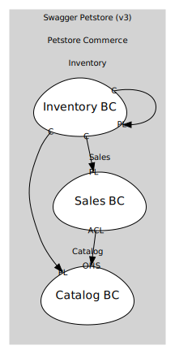

# Swagger Petstore (v3)
DDD/ODS model for Swagger Petstore v3. Inventory is a projection returning a status→count map; Orders use placed|approved|delivered.

## Domains

### [Petstore Commerce](../domains/petstore_commerce/index.md) (core)
Core pet catalog, sales, and inventory capabilities

### [Identity & Accounts](../domains/identity_&_accounts/index.md) (supporting)
Users and sessions per Petstore API

## Relationships
| Consumer | Consumed As | Provider | Consumable | Provided As |
| --- | --- | --- | --- | --- |
| [OrderApp](../domains/petstore_commerce/subdomains/sales/boundedcontexts/sales_bc/services/order_app/index.md) | anti-corruption-layer | PetApp | GetPetSummary | open-host-service |
| [InventoryProjection](../domains/petstore_commerce/subdomains/inventory/boundedcontexts/inventory_bc/aggregates/inventory_projection/index.md) | conformist | Pet | PetRegistered | published-language |
| [InventoryProjection](../domains/petstore_commerce/subdomains/inventory/boundedcontexts/inventory_bc/aggregates/inventory_projection/index.md) | conformist | Pet | PetStatusChanged | published-language |
| [InventoryProjection](../domains/petstore_commerce/subdomains/inventory/boundedcontexts/inventory_bc/aggregates/inventory_projection/index.md) | conformist | Pet | PetDeleted | published-language |
| [InventoryProjection](../domains/petstore_commerce/subdomains/inventory/boundedcontexts/inventory_bc/aggregates/inventory_projection/index.md) | conformist | Order | OrderApproved | published-language |
| [InventoryProjection](../domains/petstore_commerce/subdomains/inventory/boundedcontexts/inventory_bc/aggregates/inventory_projection/index.md) | conformist | Order | OrderDelivered | published-language |
| [InventoryProjection](../domains/petstore_commerce/subdomains/inventory/boundedcontexts/inventory_bc/aggregates/inventory_projection/index.md) | conformist | Order | OrderDeleted | published-language |
| [InventoryQuery](../domains/petstore_commerce/subdomains/inventory/boundedcontexts/inventory_bc/services/inventory_query/index.md) | conformist | InventoryProjection | InventoryUpdated | published-language |
	

