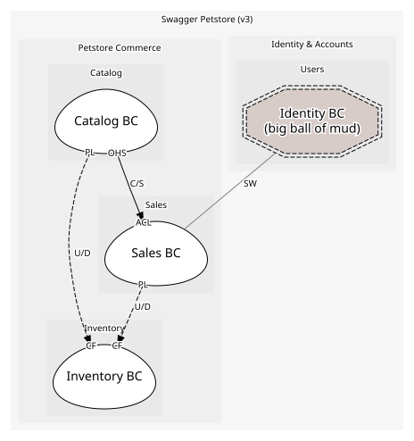

# Swagger Petstore (v3)
DDD/ODS model for Swagger Petstore v3. Inventory is a projection returning a status→count map; Orders use placed|approved|delivered.

## Domains

### [Petstore Commerce](../domains/petstore_commerce/index.md)
Core pet catalog, sales, and inventory capabilities

### [Identity & Accounts](../domains/identity_&_accounts/index.md)
Users and sessions per Petstore API

## Context Relationships
| Upstream | Relationship | Downstream | Upstream Roles | Downstream Roles |
| --- | --- | --- | --- | --- |
| Catalog BC | customer-supplier | Sales BC | open-host-service | anti-corruption-layer |
| Identity BC | separate-ways | Sales BC | - | - |
| Catalog BC | upstream-downstream (implied) | Inventory BC | published-language | conformist |
| Sales BC | upstream-downstream (implied) | Inventory BC | published-language | conformist |

## Consumptions
| Consumer | Consumed As | Provider | Consumable | Provided As |
| --- | --- | --- | --- | --- |
| [OrderApp](../boundedcontexts/sales_bc/services/order_app/index.md) | anti-corruption-layer | PetApp | GetPetSummary | open-host-service |
| [InventoryProjection](../boundedcontexts/inventory_bc/aggregates/inventory_projection/index.md) | conformist | Pet | PetRegistered | published-language |
| [InventoryProjection](../boundedcontexts/inventory_bc/aggregates/inventory_projection/index.md) | conformist | Pet | PetStatusChanged | published-language |
| [InventoryProjection](../boundedcontexts/inventory_bc/aggregates/inventory_projection/index.md) | conformist | Pet | PetDeleted | published-language |
| [InventoryQuery](../boundedcontexts/inventory_bc/services/inventory_query/index.md) | conformist | InventoryProjection | InventoryUpdated | published-language |
| [InventoryProjection](../boundedcontexts/inventory_bc/aggregates/inventory_projection/index.md) | conformist | Order | OrderApproved | published-language |
| [InventoryProjection](../boundedcontexts/inventory_bc/aggregates/inventory_projection/index.md) | conformist | Order | OrderDelivered | published-language |
| [InventoryProjection](../boundedcontexts/inventory_bc/aggregates/inventory_projection/index.md) | conformist | Order | OrderDeleted | published-language |
	

